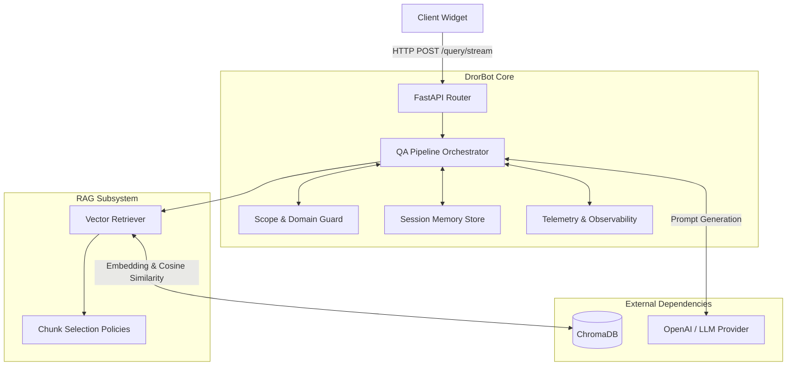
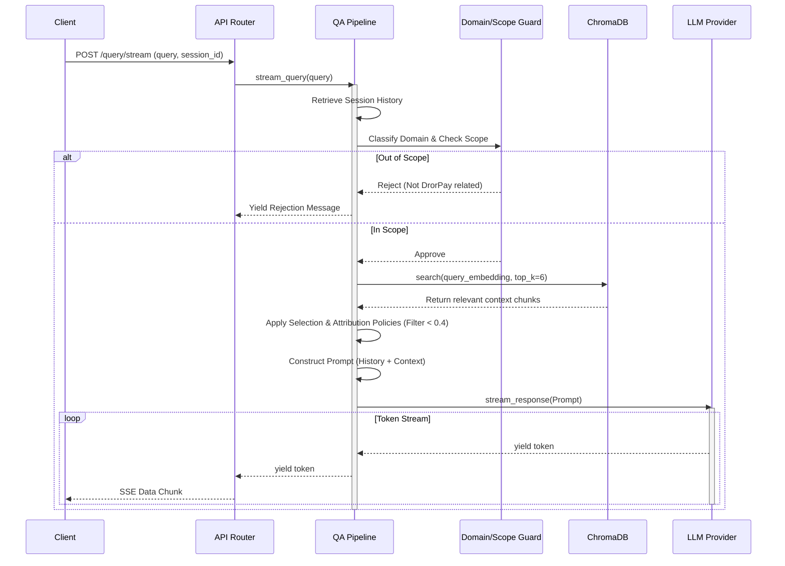

# DrorBot System Architecture and Technical Design Document

## 1. Executive Summary
DrorBot is an enterprise-grade AI support assistant built on a strict Retrieval-Augmented Generation (RAG) architecture. It is designed to safely interact with third-party developers, process technical queries regarding the DrorPay API, retrieve precise factual context from a vectorized documentation store, and stream synthesized responses back to the client. This document serves as the formal technical specification for the system's architecture, data flows, and subsystem integrations.

---

## 2. High-Level Architecture

The architecture is divided into five primary tiers: Client, API Gateway, Orchestration (QA Pipeline), Knowledge Retrieval (Vector DB), and Generation (LLM).

---

## 3. Sequence Diagram: Query Execution Flow

The following sequence details the lifecycle of a user query from ingestion to the streaming of the final token.

---

## 4. Subsystem Specifications

### 4.1. API & Ingress Layer (`app/api/`, `app/main.py`)
- **Responsibility:** Handles network ingress, request validation, and protocol wrapping.
- **Key Components:**
  - `main.py`: Bootstraps the FastAPI ASGI application, applies global CORS headers, and registers unhandled exception catchers to prevent stack trace leaks.
  - `routes.py`: Exposes REST endpoints (`/session/start`, `/query`, `/query/stream`). Wraps asynchronous Python generators into `StreamingResponse` objects for Server-Sent Events (SSE).

### 4.2. Knowledge & Scope Management (`app/core/knowledge/`)
- **Responsibility:** Validates the semantic safety and relevance of user queries before expensive DB or LLM operations occur.
- **Key Components:**
  - `domain_classifier.py`: Evaluates input text to categorize the query into predefined buckets (e.g., `webhooks`, `authentication`). This enables targeted metadata filtering in the Vector DB.
  - `scope_guard.py`: Acts as the semantic firewall. It evaluates whether the query pertains to DrorPay APIs. If malicious or irrelevant, it terminates the pipeline.

### 4.3. RAG Orchestration & Retrieval (`app/core/rag/`, `app/core/llm/`)
- **Responsibility:** Fetches relevant factual data and constructs the prompt budget.
- **Key Components:**
  - `vector_store.py`: Abstraction layer over ChromaDB. Converts text to vectors via `embedding.py` and performs Nearest Neighbor (k-NN) searches.
  - `qa_pipeline.py`: The central orchestrator. Invokes the domain classifier, calls the retriever, builds the final prompt, and manages the async stream.
  - `chunk_selection_policy.py`: Enforces relevance thresholds (e.g., rejecting vectors with cosine similarity < 0.4).
  - `prompt_compactor.py`: Dynamically calculates the token length of the history and retrieved context, truncating older messages to prevent `MaxToken` exceptions.

### 4.4. State & Memory Management (`app/core/memory/`)
- **Responsibility:** Maintains stateful conversational context for the inherently stateless LLM.
- **Key Components:**
  - `session_store.py`: Interfaces with the persistence layer (SQLite/Redis) to store conversational turns.
  - `memory_summarizer.py`: A daemonized policy that periodically condenses extremely long context windows into dense summaries, preserving logical flow while saving token budgets.

### 4.5. Security & Observability (`app/core/security/`, `app/core/observability/`)
- **Responsibility:** Ensures system safety and provides operational metrics.
- **Key Components:**
  - `pii_redactor.py`: Regex and NER-based scanning to strip credit card numbers, auth tokens, and emails before transmitting data to external LLM providers.
  - `rate_limiter.py`: Token-bucket rate limiting based on client IP or Session ID.
  - `telemetry_logger.py`: Emits structured logs containing latency metrics, token consumption, and retrieval confidence scores for downstream analysis (e.g., Datadog, ELK).

---

## 5. Data Models & Schemas

### 5.1. Vector Document Schema (ChromaDB)
When markdown documentation is ingested, it is chunked and stored with the following metadata schema:
| Field | Type | Description |
|-------|------|-------------|
| `id` | String | Unique UUID for the chunk. |
| `embedding` | Float[] | 1536-dimensional vector representation. |
| `document` | String | The raw text content of the paragraph. |
| `domain` | String | The category (e.g., `transactions`). |
| `capability` | String | Specific API capability (e.g., `create_intent`). |

### 5.2. Session Memory Schema
| Field | Type | Description |
|-------|------|-------------|
| `session_id` | String | Unique identifier for the conversation. |
| `created_at` | Timestamp | Epoch timestamp of creation. |
| `history` | List[Dict] | Array of alternating `user` and `assistant` message objects. |

---

## 6. Error Handling & Fallback Policies
- **Empty Retrieval:** If vector search yields no highly relevant chunks, `fallback_policy.py` drops the domain filter and searches globally. If still empty, a static fallback prompt is generated.
- **Provider Outages:** If the OpenAI/LLM provider throws a 5xx error, `llm.py` catches the exception and streams a graceful degradation message to the client.
