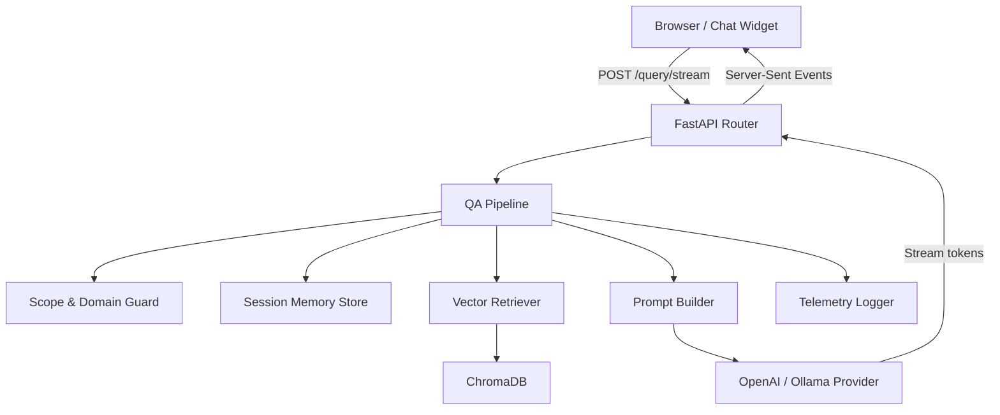

# DrorBot – Complete System Architecture & Implementation Guide

> **Audience**: New engineers, product owners, or anyone with **zero prior AI knowledge** who needs a crystal‑clear picture of how DrorBot works from inbound HTTP request to streamed AI response.

---

## 1. High‑Level Overview



**What you see:**
- The *client* (React widget) sends a JSON payload.
- FastAPI (`API`) receives it and hands the work to the **QA Pipeline**.
- The pipeline checks the request, pulls context, builds a prompt, streams tokens from the LLM, and finally pushes the tokens back to the browser.

---

## 2. Data Flow – Step‑by‑Step Sequence

```mermaid
sequenceDiagram
    participant C as Client (React)
    participant R as FastAPI Router (routes.py)
    participant P as QA Pipeline (qa_pipeline.py)
    participant G as Scope Guard (scope_guard.py)
    participant M as Memory Store (session_store.py)
    participant V as Vector Retriever (vector_store.py)
    participant DB as ChromaDB
    participant L as LLM Provider (llm.py)
    participant T as Telemetry Logger

    C->>R: POST /query/stream {query, session_id}
    R->>P: stream_query()
    activate P
    P->>M: load recent history
    M-->>P: messages list
    P->>G: enforce_scope_and_classify()
    alt Out‑of‑Scope
        G-->>P: raise Rejection
        P-->>R: SSE "I can only answer DrorPay questions."
        deactivate P
        return
    else In‑Scope
        G-->>P: domain = "webhooks"
        P->>V: search(query, domain)
        V->>DB: embedding + cosine similarity
        DB-->>V: top‑k chunks + scores
        V-->>P: chunks list
        P->>P: apply ChunkSelectionPolicy (score ≥ 0.4)
        P->>P: build_prompt(history, chunks)
        P->>L: stream_response(prompt)
        activate L
        loop Token stream
            L-->>P: token
            P-->>R: SSE token
            R-->>C: token
        end
        deactivate L
        P->>T: log_metrics()
    end
    deactivate P
```

**Explanation of each participant (file/module)** is given in the next section.

---

## 3. Component Catalog (What each directory / file does)

### 3.1 `app/main.py`
- **Purpose**: Sets up the FastAPI ASGI application, configures global CORS, and registers an error‑handling middleware that converts uncaught exceptions into JSON responses (so the frontend never sees a stack trace). 
- **Key Functions**: `create_app()`, `add_exception_handlers(app)`.

### 3.2 `app/api/routes.py`
| Endpoint | Method | Core Function | Description |
|----------|--------|---------------|-------------|
| `/query/stream` | POST | `handle_query_stream` | Receives `query` + `session_id`, calls `qa_pipeline.stream_query`, wraps the async generator in a `StreamingResponse` with `text/event-stream` MIME (SSE). |
| `/session/start` | POST | `start_session` | Generates a UUID, inserts an empty conversation row in the session DB. |
| `/feedback` | POST | `submit_feedback` | Stores thumbs‑up/down and optional comments for later analytics. |

### 3.3 Knowledge & Scope (`app/core/knowledge/`)
| File | Responsibility | Important Functions |
|------|----------------|---------------------|
| `domain_classifier.py` | Maps a free‑text query to a **domain** (e.g., `authentication`, `transactions`, `webhooks`). Uses a tiny LLM prompt that returns a single token representing the domain. | `classify_domain(query: str) -> str` |
| `scope_guard.py` | Enforces *“only DrorPay‑related questions”*. If the query falls outside the allowed domain, the guard instantly returns a rejection message. | `enforce_drorpay_scope(query: str) -> None` |

### 3.4 RAG Orchestration (`app/core/llm/`)
| File | Role | Core Functions |
|------|------|----------------|
| `qa_pipeline.py` | **Orchestrator** – the brain that wires together memory, guard, retrieval, prompt building, and streaming. | `stream_query(query, session_id)` – async generator that yields SSE chunks; `_build_qa_prompt(...)` – constructs the final prompt string. |
| `vector_store.py` | Thin wrapper over **ChromaDB**. Handles embedding generation (`EmbeddingProvider`) and nearest‑neighbor search. | `search(query: str, domain: Optional[str] = None, top_k: int = 6) -> List[Chunk]` |
| `embedding.py` | Calls the configured embedding model (OpenAI `text‑embedding‑3‑small` or Ollama). Returns a list of floats (the vector). |
| `prompt_compactor.py` | Estimates token length of the history + retrieved chunks and truncates the oldest messages if the LLM token limit would be exceeded. |
| `llm.py` | Low‑level wrapper around the **OpenAI/LLM provider**. Uses `AsyncOpenAI` with `stream=True` to yield tokens one‑by‑one. |
| `prompts.py` | Central place for **system prompts** (`QA_SYSTEM_PROMPT`, `FALLBACK_PROMPT`, `ENFORCE_SCOPE_PROMPT`). Changing tone or adding policy rules happens here only. |

### 3.5 Memory & Session (`app/core/memory/`)
| File | Responsibility |
|------|----------------|
| `session_store.py` | Persists conversation turns in a SQLite DB (fallback to in‑memory if `REDIS_ENABLED=false`). Provides `get(session_id)` and `append(session_id, role, content)`. |
| `memory_summarizer.py` | Background coroutine that, when a session exceeds `MAX_TOKENS`, runs a summarisation LLM (e.g., `gpt‑4o‑mini`) and replaces the oldest messages with a concise summary. |

### 3.6 Security & Observability (`app/core/security/` & `app/core/observability/`)
| File | What it guards / logs |
|------|-----------------------|
| `pii_redactor.py` | Scans user input for credit‑card numbers, SSNs, email addresses, and replaces them with `[REDACTED]`. Prevents leaking PII to external LLM providers. |
| `rate_limiter.py` | Simple token‑bucket implementation per IP or `session_id`. Configurable via `.env` (`RATE_LIMIT=30/min`). |
| `telemetry_logger.py` | Structured JSON logs each request: latency, number of retrieved chunks, top similarity score, total tokens used, and any fallback activation. Useful for Grafana/Datadog dashboards. |

### 3.7 Utilities (`app/utils/`)
| File | Purpose |
|------|---------|
| `constants.py` | Centralised constants (e.g., `MAX_TOKENS = 1024`, `SIMILARITY_THRESHOLD = 0.4`). |
| `logger.py` | Wrapper around Python `logging` that outputs JSON‑structured logs for observability. |
| `patterns.py` | Regex helpers for PII detection, URL sanitisation, etc. |

### 3.8 Data‑Ingestion Scripts (`app/scripts/`)
| Script | Role |
|--------|------|
| `seed_chroma.py` | Walks `app/data/knowledge_base/*.json` (or markdown files), chunks each document (≈200‑word chunks), generates embeddings, and upserts them into ChromaDB. Run once on fresh deployment or when docs are updated. |
| `sync_markdown.py` | Convenience wrapper around `seed_chroma.py` for **Git‑hook** style syncing: `git pull && python sync_markdown.py`. |
| `migrate_chunks.py` | Migrates old chunk schema (v1 → v2) without data loss. |

---

## 4. Data Models & Schemas

### 4.1 Vector Document (ChromaDB) 
| Field | Type | Description |
|-------|------|-------------|
| `id` | `str` (UUID) | Unique identifier for the chunk. |
| `embedding` | `list[float]` (1536 dims) | Numerical representation of the chunk's semantic meaning. |
| `content` | `str` | Raw text of the documentation paragraph. |
| `metadata` | `dict` | Includes `domain` (e.g., `transactions`), `capability` (e.g., `create_intent`), and optional `source_file`. |

### 4.2 Session Memory Record
| Column | Type | Meaning |
|--------|------|---------|
| `session_id` | `TEXT` | Primary key – ties all messages together. |
| `created_at` | `TIMESTAMP` | When the session started. |
| `role` | `TEXT` (`user`/`assistant`) | Who said the message. |
| `content` | `TEXT` | The actual text. |
| `created_at_msg` | `TIMESTAMP` | When that particular message was stored. |

---

## 5. Error‑Handling & Fallback Policies
1. **No Relevant Chunks** – `fallback_policy.py` drops the domain filter and re‑runs a global search. If still empty, a static `FALLBACK_PROMPT` is used (“I couldn't find an exact match; here's a generic answer”).
2. **Provider Time‑outs** – `llm.py` catches `openai.RateLimitError` and streams a friendly “The service is busy, please try again in a moment.” message.
3. **Scope Violation** – `scope_guard.py` returns a 400‑style SSE payload: `{"error": "Out‑of‑scope"}` and stops further processing.
4. **Token‑Window Overflow** – `prompt_compactor.py` measures the token count; if > `MAX_TOKENS` it drops the oldest history entries before building the final prompt.

---

## 6. Deployment & Configuration (`.env`)
```
# Server
PORT=8000
PROVIDER=openai          # or ollama / gemini

# OpenAI credentials
OPENAI_API_KEY=your_key
OPENAI_MODEL=gpt-4o-mini
OPENAI_EMBEDDING_MODEL=text-embedding-3-small

# ChromaDB connection (can be hosted or local)
CHROMA_DB_API_KEY=your_chroma_key
CHROMA_DB_TENANT=drorpay
CHROMA_DB_NAME=dror-bot

# Optional Redis cache for session storage
REDIS_ENABLED=false

# Rate limiting (requests per minute per IP)
RATE_LIMIT=30

# Retrieval thresholds
SIMILARITY_THRESHOLD=0.4
TOP_K=6
```
- Changing any of these values **does not require code changes**; the system reads them at runtime.

---

## 7. Extending / White‑Labeling (Brief)
To repurpose DrorBot for another business (e.g., a hotel booking assistant):
1. Create a new `.env` with `BUSINESS_NAME`, `BUSINESS_CONTEXT`, and a fresh `CHROMA_DB_NAME`.
2. Populate the new Chroma collection via `seed_chroma.py` using the hotel docs.
3. Edit `app/utils/prompts.py` to replace hard‑coded `DrorPay` strings with `os.getenv("BUSINESS_NAME")`.
4. Optionally adjust `domain_classifier.py` to load a domain list from `domains.json`.
*No code‑level changes are required beyond the configuration and prompt files.*

---

## 8. Glossary (for absolute beginners)
- **LLM** – Large Language Model, the AI that generates natural‑language text.
- **RAG** – Retrieval‑Augmented Generation, a pattern that couples a search engine with an LLM.
- **Embedding** – A high‑dimensional vector that captures the semantic meaning of a piece of text.
- **ChromaDB** – A vector‑store database that stores embeddings and enables fast nearest‑neighbor search.
- **SSE** – Server‑Sent Events, a one‑direction streaming protocol used to push tokens to the browser.
- **Token** – The smallest unit the LLM works with (roughly 4 characters of English text).
- **Scope Guard** – Logic that blocks out‑of‑domain queries before any expensive work is performed.

---

## 9. How to Verify Everything Works (Quick Checklist)
1. **Start the backend**: `uvicorn app.main:app --reload`.
2. **Seed the knowledge base** (once): `python app/scripts/seed_chroma.py`.
3. **Open the demo UI** (if you have a React client) and send a query like *"How do I verify a webhook signature?"*.
4. **Inspect the logs** (`logs/telemetry.log`) – you should see entries for `latency_ms`, `top_similarity`, `tokens_used`.
5. **Check the DB** – open `app/data/sessions.db` with a SQLite viewer; you will see a row per message.

---

### 🎉 End of Document
You now have a **complete, end‑to‑end, beginner‑friendly yet technically accurate** reference for DrorBot. Feel free to share this with any teammate who needs to understand, debug, or extend the system.
